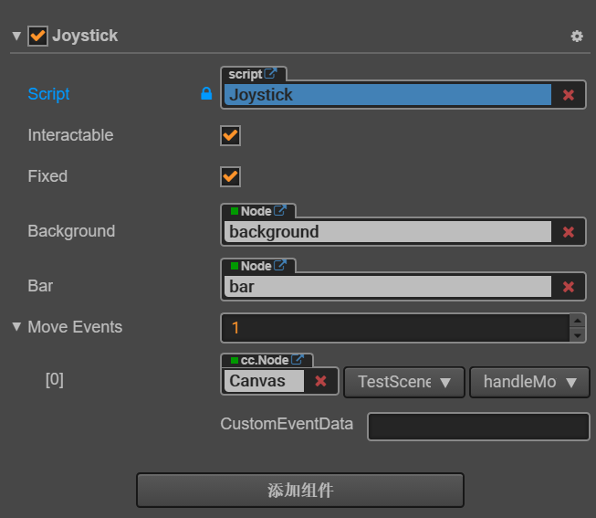
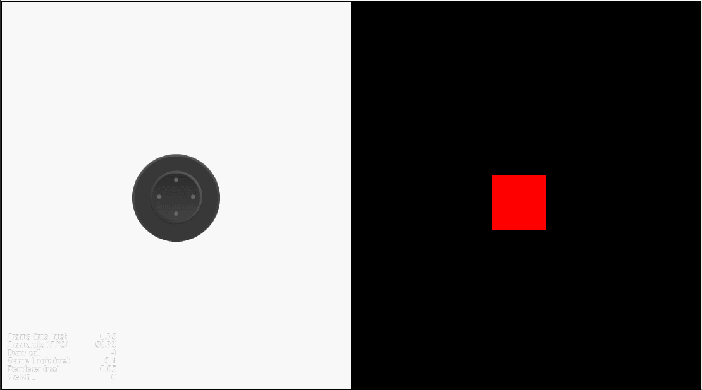

# Joystick
通用摇杆组件，固定位置或范围内可移动位置，事件绑定。
# 用法
1.将 **Joystick** 预制体拖入场景，调整背景大小用于限制点击范围,调整后将背景图片隐藏

2.绑定事件到对应脚本内的函数

示例：
```
import { JoystickEvent, Joystick } from "../components/joystick/Joystick";

const { ccclass, property } = cc._decorator;

@ccclass
export class TestScene extends cc.Component {

    @property(cc.Node)
    private playerNode: cc.Node = null;
    @property(cc.Integer)
    private speed: number = 300;

    private moveDirVec: cc.Vec2 = cc.v2();

    handleMove(event: JoystickEvent) {
        this.moveDirVec = Joystick.GetDirVecByDir(event.newDir);
    }

    update(dt: number) {
        let distance = this.speed * dt;
        let moveVec = this.moveDirVec.mul(distance);
        this.playerNode.position = this.playerNode.position.add(moveVec);
    }

}
```
# 预览
